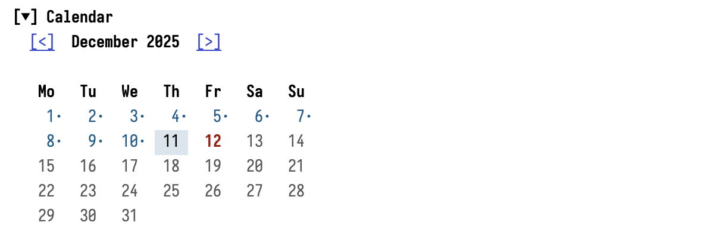
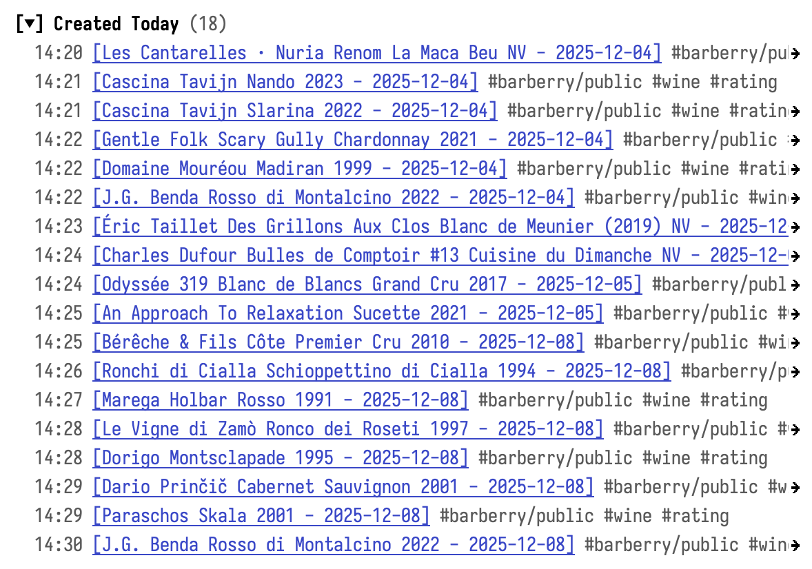
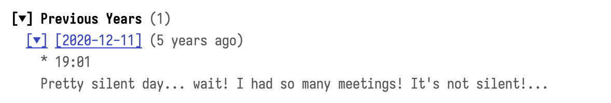

#+title: vulpea-journal
#+author: Boris Buliga

#+begin_html

  
  
  

  

#+end_html

A journaling interface for [[https://github.com/d12frosted/vulpea][vulpea]] that integrates seamlessly with [[https://github.com/d12frosted/vulpea-ui][vulpea-ui]] sidebar.

* What is vulpea-journal?

vulpea-journal brings the power of journaling to your vulpea-based note system. Think of it as [[https://github.com/bastibe/org-journal][org-journal]] rebuilt from the ground up for vulpea, with a modern reactive UI.

*Key features:*

- *Flexible granularity* - One file per day, or one file per month with daily headings
- *Sidebar widgets* - Calendar, navigation, related notes - all in the vulpea-ui sidebar
- *Calendar integration* - See which days have entries, jump to any date
- *Previous years* - "On this day" view showing what you wrote in past years
- *Zero window management* - Uses vulpea-ui sidebar, no custom layouts to break

* Quick Start

** 1. Install

vulpea-journal requires:
- Emacs 29.1+
- [[https://github.com/d12frosted/vulpea][vulpea]] 2.0+
- [[https://github.com/d12frosted/vulpea-ui][vulpea-ui]] 1.0+
- [[https://github.com/magnars/dash.el][dash]] 2.20+

*** Using package.el (MELPA)

#+begin_src emacs-lisp
(package-install 'vulpea-journal)
#+end_src

*** Using straight.el

#+begin_src emacs-lisp
(straight-use-package 'vulpea-journal)
#+end_src

*** Using elpaca

#+begin_src emacs-lisp
(elpaca vulpea-journal)
#+end_src

*** Using Doom Emacs

In =packages.el=:

#+begin_src emacs-lisp
(package! vulpea-journal)
#+end_src

In =config.el=:

#+begin_src emacs-lisp
(use-package! vulpea-journal
  :after (vulpea vulpea-ui)
  :config
  (vulpea-journal-setup))
#+end_src

*** Configuration

#+begin_src emacs-lisp
(use-package vulpea-journal
  :after (vulpea vulpea-ui)
  :config
  (vulpea-journal-setup))
#+end_src

** 2. Widgets are auto-registered

=vulpea-journal-setup= automatically loads =vulpea-journal-ui= and registers all sidebar widgets — you don't need to require it separately. Widgets only appear when viewing journal notes.

Default widget order interleaves with vulpea-ui widgets:

| Widget                 | Order | Appears...                  |
|------------------------+-------+-----------------------------|
| journal-nav            |    50 | Before stats                |
| stats                  |   100 | (vulpea-ui)                 |
| journal-calendar       |   150 | After stats                 |
| outline                |   200 | (vulpea-ui)                 |
| backlinks              |   300 | (vulpea-ui)                 |
| journal-created-today  |   350 | After backlinks             |
| journal-previous-years |   360 | After journal-created-today |
| links                  |   400 | (vulpea-ui)                 |

To customize the order, see [[*Widget Order Configuration][Widget Order Configuration]] below.

** 3. Add a keybinding

#+begin_src emacs-lisp
(global-set-key (kbd "C-c j") #'vulpea-journal)
#+end_src

** 4. Start journaling!

Press =C-c j= to open today's journal. The sidebar will show journal-specific widgets.

* How It Works

** Journal Notes

Journal notes are regular vulpea notes identified by a tag (default: ="journal"=). Depending on the template granularity:

- *Daily* (default): one file per day (e.g., =journal/2025-12-08.org=)
- *Monthly*: one file per month (e.g., =journal/2025-12.org=) with daily entries as headings (e.g., =* 08 Monday=)

Each note has a *CREATED property* storing the date for querying.

When you call =vulpea-journal=, it:
1. Finds or creates the note for that date
2. Opens it in your main window (for monthly, navigates to the heading)
3. Shows the vulpea-ui sidebar with journal widgets

** Sidebar Integration

vulpea-journal doesn't create its own windows. Instead, it provides *widgets* that plug into vulpea-ui's sidebar system. This means:

- No window management bugs
- Consistent UI with the rest of vulpea-ui
- Widgets automatically appear/disappear based on what you're viewing

Journal widgets check if the current note is a journal entry. When you view a non-journal note, they simply hide themselves.

* Configuration

** Template

Customize how journal notes are created. Use the template builder functions for convenience:

*** Daily (one file per day, default)

#+begin_src emacs-lisp
(setq vulpea-journal-default-template
      (vulpea-journal-template-daily))
#+end_src

This is equivalent to the default behavior. You can override any parameter:

#+begin_src emacs-lisp
(setq vulpea-journal-default-template
      (vulpea-journal-template-daily
       :file-name "daily/%Y-%m-%d.org"
       :title "%A, %B %d, %Y"
       :body "* Morning\n\n* Evening\n"))
#+end_src

*** Monthly (one file per month)

#+begin_src emacs-lisp
(setq vulpea-journal-default-template
      (vulpea-journal-template-monthly))
#+end_src

This creates one file per month (e.g., =journal/2025-12.org=) with each day as a heading (e.g., =* 08 Monday=). Override any parameter:

#+begin_src emacs-lisp
(setq vulpea-journal-default-template
      (vulpea-journal-template-monthly
       :file-name "journal/%Y/%m.org"
       :entry-title "%d %A"))
#+end_src

Monthly template parameters:

| Parameter       | Default            | Description                      |
|-----------------+--------------------+----------------------------------|
| =:file-name=    | =journal/%Y-%m.org= | strftime format for monthly file |
| =:title=        | =%Y-%m=             | File-level note title            |
| =:entry-level=  | =1=                 | Heading level for daily entries (derived when =:entry-groups= is set) |
| =:entry-title=  | =%d %A=             | strftime format for heading      |
| =:entry-groups= | =nil=               | Optional grouping headings (see below) |
| =:aliases=      | =nil=               | Per-entry aliases, computed or static (see below) |
| =:tags=         | =("journal")=       | Tags (first one identifies journals) |

For monthly templates, =:body=, =:properties=, =:context=, and =:aliases= apply to each daily entry, while =:head= seeds the monthly file (the container). =:meta= is file-level only: monthly heading entries do not carry metadata, because =vulpea-create= stores metadata on file-level notes only.

By default, daily entries are placed directly under the monthly file. To nest them under intermediate grouping headings (for example, one heading per ISO week), use =:entry-groups=:

#+begin_src emacs-lisp
(setq vulpea-journal-default-template
      (vulpea-journal-template-monthly
       :entry-title  "%d %A"
       :entry-groups '("week %V")
       :body         "*** Tasks\n\n*** Notes\n"))
#+end_src

Each element of =:entry-groups= adds one heading level between the file and the daily entry. An element is either a =strftime= format string (expanded for the entry's date) or a function of one argument (the date) returning the heading title. A single spec may be given without wrapping it in a list. Group headings are created on demand and reused across days that resolve to the same title, and =:entry-level= is derived as =1 + (length entry-groups)= so lookup and creation stay in sync. The template above produces:

#+begin_example
#+title: 2026-06
#+filetags: :journal:
* week 24
** 08 Monday
*** Tasks
*** Notes
** 09 Tuesday
*** Tasks
*** Notes
* week 25
** 15 Monday
*** Tasks
*** Notes
#+end_example

Because =:body= is inserted verbatim at fixed heading levels, nest its subheadings one level below the entry (=***= for entries at level 2, as above).

*** Entry aliases

Give each entry an alias (or several) with =:aliases=, so you can link to it by a short stamp instead of its full heading title. Each element is a =strftime= string expanded for the entry's date, or a function of the date; a single spec needs no list. Works for daily and monthly templates.

#+begin_src emacs-lisp
(setq vulpea-journal-default-template
      (vulpea-journal-template-monthly
       :entry-title  "journal <%Y-%m-%d %a %H:%M>"
       :entry-groups '("week %V")
       :aliases      '("%Y-%m-%d")))
#+end_src

Every entry then carries a =2026-06-08= style alias (computed from the entry's date, not today), written to the property named by =vulpea-buffer-alias-property= (=ALIASES= by default, =ROAM_ALIASES= if you configure it). See the vulpea user guide, "Managing Aliases", for how aliases are searched and linked.

*** Raw template plist

You can also provide a raw plist directly:

#+begin_src emacs-lisp
(setq vulpea-journal-default-template
      '(:file-name "journal/%Y-%m-%d.org"    ; File path (strftime format)
        :title "%Y-%m-%d %A"                  ; Note title (strftime format)
        :tags ("journal")                     ; Tags (first one identifies journals)
        :head "#+created: %<[%Y-%m-%d]>"      ; Header content
        :body "* Morning\n\n* Evening\n"))    ; Initial body
#+end_src

*Important:* The =:file-name=, =:title=, and =:entry-title= use =strftime= format because they're expanded for the /target date/, not the current time. When you open the journal for December 25th, the file will be =journal/2025-12-25.org= regardless of today's date.

Other keys (=:head=, =:body=) use vulpea's =%<format>= syntax and are expanded at creation time.

*** Dynamic Templates

For more control, use a function:

#+begin_src emacs-lisp
(setq vulpea-journal-default-template
      (lambda (date)
        (let ((weekday (format-time-string "%u" date)))
          (list
           :file-name "journal/%Y-%m-%d.org"
           :title (format-time-string "%Y-%m-%d %A" date)
           :tags '("journal")
           :head "#+created: %<[%Y-%m-%d]>"
           :body (if (member weekday '("6" "7"))
                     "* Weekend\n\n"
                   "* Work\n\n* Personal\n")))))
#+end_src

** Calendar Widget

#+begin_src emacs-lisp
;; Start week on Sunday (0) or Monday (1, default)
(setq vulpea-journal-ui-calendar-week-start 1)
#+end_src

** Created Today Widget

#+begin_src emacs-lisp
;; Include journal notes in the "created today" list
(setq vulpea-journal-ui-created-today-exclude-journal nil)  ; default: t
#+end_src

** Previous Years Widget

#+begin_src emacs-lisp
;; How many years to look back
(setq vulpea-journal-ui-previous-years-count 5)  ; default: 5

;; Characters to show in preview
(setq vulpea-journal-ui-previous-years-preview-chars 256)

;; Hide org drawers in preview
(setq vulpea-journal-ui-previous-years-hide-drawers t)  ; default: t

;; Start with previews expanded
(setq vulpea-journal-ui-previous-years-expanded t)  ; default: t
#+end_src

** Widget Order Configuration

Customize where journal widgets appear relative to vulpea-ui widgets:

#+begin_src emacs-lisp
(setq vulpea-journal-ui-widget-orders
      '((nav . 50)              ; before stats (100)
        (calendar . 150)        ; after stats, before outline (200)
        (created-today . 350)   ; after backlinks (300)
        (previous-years . 360)))
#+end_src

Note that =vulpea-journal-ui-widget-orders= uses short keys (=nav=, =calendar=, =created-today=, =previous-years=), and it is read once, when the widgets are registered. So set it *before* calling =vulpea-journal-setup= (e.g. via =:custom= in =use-package=).

Example: Move calendar before stats:

#+begin_src emacs-lisp
(use-package vulpea-journal
  :custom
  (vulpea-journal-ui-widget-orders
   '((nav . 50)
     (calendar . 90)            ; now before stats
     (created-today . 350)
     (previous-years . 360))))
#+end_src

Reference orders for vulpea-ui widgets: stats=100, outline=200, backlinks=300, links=400.

If you want to change the order *after* the widgets are already registered, use =vulpea-ui-widget-set= instead. It operates on vulpea-ui's widget registry, where journal widgets are registered under their full names: =journal-nav=, =journal-calendar=, =journal-created-today=, =journal-previous-years=.

#+begin_src emacs-lisp
(vulpea-ui-widget-set 'journal-calendar :order 90)  ; now before stats
#+end_src

* Commands

| Command                   | Description                                             |
|---------------------------+---------------------------------------------------------|
| =vulpea-journal=          | Open today's journal (or specify date programmatically) |
| =vulpea-journal-today=    | Open today's journal                                    |
| =vulpea-journal-date=     | Prompt for a date and open its journal                  |
| =vulpea-journal-next=     | Go to next journal entry                                |
| =vulpea-journal-previous= | Go to previous journal entry                            |
| =vulpea-journal-setup=    | Enable calendar/sidebar integration and register widgets |

*Note*: When using =vulpea-journal-date= to input a date, you can leverage standard Org-mode keybindings for navigating between days (refer to the =org-read-date= documentation for details). Additionally, =M-<left>= and =M-<right>= allow you to move specifically through days that already have journal entries.

* Sidebar Keybindings

When viewing a journal note, the sidebar provides quick navigation:

| Key | Action                         |
|-----+--------------------------------|
| =[= | Go to previous journal entry   |
| =]= | Go to next journal entry       |
| =t= | Go to today's journal          |
| =d= | Pick a date                    |

* Calendar Integration

After calling =vulpea-journal-setup=, the Emacs calendar gains journal superpowers via =vulpea-journal-calendar-mode=:

| Key | Action                         |
|-----+--------------------------------|
| =j= | Open journal for date at point |
| =]= | Jump to next journal entry     |
| =[= | Jump to previous journal entry |

Days with journal entries are highlighted in the calendar.

The minor mode is automatically enabled in calendar buffers. You can toggle it with =M-x vulpea-journal-calendar-mode= if needed.

* Capture

Sometimes you just want to jot something into today's note without the sidebar and its widgets popping up. =vulpea-journal-capture-target= is an =org-capture= target function for exactly that. It creates today's note on demand (so the first capture of the day also registers it in the vulpea database) and moves point into place. It never touches the vulpea-ui sidebar.

Add a capture template that uses it as a =(function ...)= target:

#+begin_src emacs-lisp
(add-to-list 'org-capture-templates
             '("j" "Journal" entry
               (function vulpea-journal-capture-target)
               "* %<%H:%M> %?"))
#+end_src

The same template works for both daily and monthly journals: the target reads your =vulpea-journal-default-template= and positions point accordingly. The heading is prefixed with just the time (=%<%H:%M>=) because the date is already implied by the file (daily) or the day heading (monthly), so a full timestamp would be redundant.

For a *daily* template (one file per day), an =entry= capture is appended as a new top-level heading at the end of today's file:

#+begin_example
#+title: 2026-07-23 Thursday
#+filetags: :journal:
* 08:15 Morning thought
* 21:40 Evening thought
#+end_example

For a *monthly* template (one file per month, days as headings), the entry nests as a child of today's day heading, so you do not need to narrow to it yourself:

#+begin_example
#+title: 2026-07
#+filetags: :journal:
* 23 Thursday
** 09:12 First quick note
** 14:30 Second quick note
#+end_example

The function only positions point, so the capture =type= (=entry=, =item=, =plain=, ...) and the content come entirely from your template. It also accepts an optional =DATE= argument if you want to capture into a specific day instead of today.

If you would rather just visit today's note and write in it directly (no capture buffer, still no sidebar), skip the template and call:

#+begin_src emacs-lisp
(vulpea-visit (vulpea-journal-note (current-time)))
#+end_src

* Widgets Reference

** vulpea-journal-widget-nav

Shows the current journal date and navigation buttons:

Clicking *Prev/Next* navigates by one calendar day (creating the entry if needed).
Clicking *Today* jumps to today's journal.

Note: The sidebar keybindings =[= and =]= behave differently — they jump to the next/previous *existing* journal entry, skipping days without entries.

** vulpea-journal-widget-calendar

Interactive month calendar:

- *Bold* = today
- *Highlighted* = selected date
- *Dot (·)* = has journal entry
- Click any date to open its journal

Click the =<= and =>= buttons to navigate months without changing the selected date.

** vulpea-journal-widget-created-today

Lists all notes created on the journal's date (from the CREATED property):

Click a note to visit it. Times come from the CREATED property timestamp.

** vulpea-journal-widget-previous-years

Shows journal entries from the same date in previous years:

Click the date to visit that journal. Click =▸=/=▾= to expand/collapse the preview.

* Tips & Tricks

** Open journal on Emacs startup

#+begin_src emacs-lisp
(add-hook 'emacs-startup-hook #'vulpea-journal)
#+end_src

** Weekly review workflow

Use =vulpea-journal-dates-in-range= to query entries:

#+begin_src emacs-lisp
(defun my/journal-this-week ()
  "Get all journal dates from this week."
  (let* ((today (current-time))
         (dow (string-to-number (format-time-string "%u" today)))
         (start (time-subtract today (days-to-time (1- dow))))
         (end (time-add start (days-to-time 7))))
    (vulpea-journal-dates-in-range start end)))
#+end_src

** Custom journal tag

If you want a different tag than ="journal"=, set =vulpea-journal-tag=:

#+begin_src emacs-lisp
(setq vulpea-journal-tag "daily-note")
#+end_src

Template builders (=vulpea-journal-template-daily=, =vulpea-journal-template-monthly=) use =vulpea-journal-tag= as the default tag automatically. If you use a raw plist for =vulpea-journal-default-template=, make sure the first element of =:tags= matches =vulpea-journal-tag=.

* Troubleshooting

** Widgets don't appear in sidebar

1. Ensure =vulpea-journal-ui= is loaded (widgets auto-register on load)
2. Check that you're viewing a journal note (has the journal tag)
3. Try =M-x vulpea-ui-sidebar-refresh=

** Date extraction fails

vulpea-journal extracts dates from the *CREATED property*. Ensure your template includes:

#+begin_src emacs-lisp
:head "#+created: %<[%Y-%m-%d]>"
#+end_src

Supported formats:
- =[2025-12-08]=
- =[2025-12-08 08:54]=
- =2025-12-08=

** Calendar marks don't appear

Ensure =vulpea-journal-setup= is called in your config. This adds the necessary hooks:

#+begin_src emacs-lisp
(add-hook 'calendar-today-visible-hook #'vulpea-journal-calendar-mark-entries)
(add-hook 'calendar-today-invisible-hook #'vulpea-journal-calendar-mark-entries)
#+end_src

** Calendar keybindings don't work

=vulpea-journal-setup= enables =vulpea-journal-calendar-mode= in calendar buffers. If keybindings aren't working:

1. Verify the minor mode is active by running =M-x vulpea-journal-calendar-mode= to toggle it
2. Ensure =vulpea-journal-setup= was called before opening the calendar

** Existing journal files not in database

If you have existing journal files that are not properly indexed in the vulpea database (e.g., manually created files, or files without an =:ID:= property), vulpea-journal will show an error when you try to navigate to that date. This is a safety measure to prevent accidentally overwriting your files.

To fix this, you have two options:

1. *Add proper properties and sync:* Ensure each file has an =:ID:= property in its property drawer, then run =M-x vulpea-db-sync-full-scan= to index them.

2. *Delete and recreate:* If the files don't contain important content, delete them and let vulpea-journal create new ones.

Additionally, if your notes lack the =CREATED= property, vulpea-journal won't find them for date-based queries (like "notes created today"). The note itself will work fine if opened directly.

** Migration script

If you have many existing journal files that need =:ID:=, =CREATED= properties, and the journal filetag, you can use this script to migrate them automatically.

*WARNING: Back up your notes before running this script!*

#+begin_src emacs-lisp
(defun vulpea-journal-migrate-files (directory)
  "Migrate journal files in DIRECTORY to vulpea-journal format.
Adds :ID: property if missing.
Adds CREATED property if missing (inferred from filename or title).
Adds journal filetag if missing (using `vulpea-journal-tag').

After running this, execute `vulpea-db-sync-full-scan' to index the files."
  (interactive "DJournal directory: ")
  (let* ((files (directory-files directory t "\\.org$"))
         (count (length files))
         (modified 0)
         (skipped 0))
    (message "Processing %d files in %s..." count directory)
    (dolist (file files)
      (message "  Processing %s..." (file-name-nondirectory file))
      (with-current-buffer (find-file-noselect file)
        (let ((changed nil)
              (filename (file-name-base file)))
          ;; Check/add ID property
          (goto-char (point-min))
          (unless (org-entry-get (point) "ID")
            (org-id-get-create)
            (setq changed t)
            (message "    Added ID"))
          ;; Check/add CREATED property
          (goto-char (point-min))
          (unless (org-entry-get (point) "CREATED")
            (when-let* ((date (vulpea-journal-migrate--infer-date file)))
              (org-set-property "CREATED" date)
              (setq changed t)
              (message "    Added CREATED: %s" date)))
          ;; Check/add journal filetag
          (goto-char (point-min))
          (unless (member vulpea-journal-tag (vulpea-buffer-tags-get))
            (vulpea-buffer-tags-add (list vulpea-journal-tag))
            (setq changed t)
            (message "    Added filetag: %s" vulpea-journal-tag))
          ;; Save if modified
          (if changed
              (progn
                (save-buffer)
                (setq modified (1+ modified)))
            (setq skipped (1+ skipped)))
          (kill-buffer))))
    (message "Migration complete: %d modified, %d skipped" modified skipped)
    (message "Run M-x vulpea-db-sync-full-scan to index the migrated files.")))

(defun vulpea-journal-migrate--infer-date (file)
  "Infer date from FILE path or title.
Returns date string in format [YYYY-MM-DD] or nil."
  (let ((filename (file-name-base file)))
    (cond
     ;; Try common filename patterns: YYYYMMDD, YYYY-MM-DD, YYYY_MM_DD
     ((string-match "\\([0-9]\\{4\\}\\)[_-]?\\([0-9]\\{2\\}\\)[_-]?\\([0-9]\\{2\\}\\)" filename)
      (format "[%s-%s-%s]"
              (match-string 1 filename)
              (match-string 2 filename)
              (match-string 3 filename)))
     ;; Try reading title from file
     (t
      (with-temp-buffer
        (insert-file-contents file)
        (goto-char (point-min))
        (when (re-search-forward "^#\\+title:[ \t]*\\(.+\\)" nil t)
          (let ((title (match-string 1)))
            (when (string-match "\\([0-9]\\{4\\}\\)[_-]?\\([0-9]\\{2\\}\\)[_-]?\\([0-9]\\{2\\}\\)" title)
              (format "[%s-%s-%s]"
                      (match-string 1 title)
                      (match-string 2 title)
                      (match-string 3 title))))))))))
#+end_src

Usage:

1. Back up your journal directory
2. Evaluate the code above
3. Run =M-x vulpea-journal-migrate-files= and select your journal directory
4. Run =M-x vulpea-db-sync-full-scan= to index the migrated files

* API Reference

** Functions

#+begin_src emacs-lisp
;; Template builders
(vulpea-journal-template-daily)     ; Daily template (one file per day)
(vulpea-journal-template-monthly)   ; Monthly template (one file per month)

;; Note identification
(vulpea-journal-note-p note)        ; Is NOTE a journal note?
(vulpea-journal-note-date note)     ; Extract date from journal NOTE

;; Note retrieval
(vulpea-journal-note date)          ; Get/create journal for DATE
(vulpea-journal-find-note date)     ; Find existing journal (no create)

;; Capture
(vulpea-journal-capture-target)     ; `org-capture' target: point in today's note

;; Queries
(vulpea-journal-all-dates)          ; All dates with journals
(vulpea-journal-dates-in-month m y) ; Journals in month M of year Y
(vulpea-journal-dates-in-range a b) ; Journals between dates A and B
(vulpea-journal-notes-for-date-across-years date n)  ; Same date in past N years
#+end_src

** Faces

- =vulpea-journal-calendar-entry-face= - Calendar days with entries
- =vulpea-journal-ui-widget-title= - Widget headers
- =vulpea-journal-ui-calendar-date= - Regular calendar days
- =vulpea-journal-ui-calendar-today= - Today in calendar
- =vulpea-journal-ui-calendar-entry= - Days with entries in widget
- =vulpea-journal-ui-calendar-selected= - Selected day in widget

* Contributing

Contributions welcome! Please open issues and PRs on GitHub.

* License

GPLv3. See [[file:LICENSE][LICENSE]] for details.

* Support

If you enjoy this project, you can support its development via [[https://github.com/sponsors/d12frosted][GitHub Sponsors]] or [[https://www.patreon.com/d12frosted][Patreon]].
